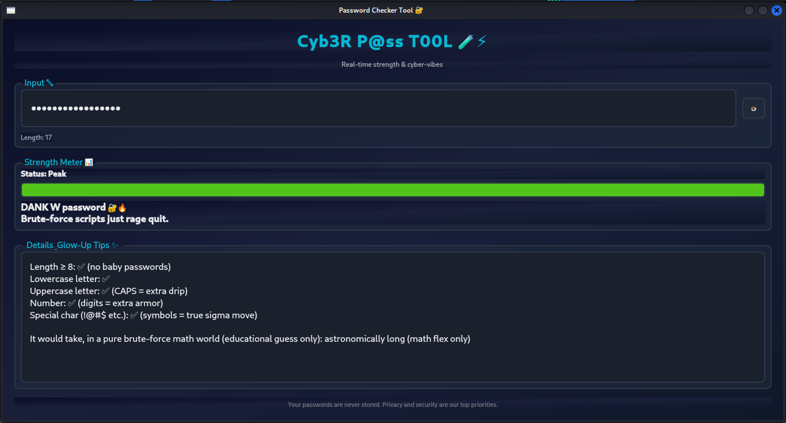

🎉 Cyb3r P@ss T00L – Gen-Z Password Strength Checker 🚀

Dive into Cyb3r P@ss T00L, a fun & flashy password strength analyzer crafted for Gen-Z netizens. It gives you real-time feedback as you type, complete with a sleek dark mode and playful, slang-filled UI vibes. Level up your security game and make password checking feel like a cyberpunk adventure 🚀🔐.

📸 Screenshot

Here's a peek at the Cyb3r P@ss T00L interface in action:

📦 Installation & Setup

Clone the repo: git clone https://github.com/YourUsername/CODECRAFT_CS_03.git

Navigate into the directory: cd CODECRAFT_CS_03

Run the tool: python3 cyberpasschecker.py

(Make sure Python 3.x and PyQt5 are installed on your system!)

💡 Features

🔥 Real-time password strength meter that updates as you type

⏱ Entropy & brute-force time estimation for how long a hacker would need

🎨 Stylish dark mode UI with Gen-Z vibes and slang-laced feedback

🐍 Built with PyQt5 and custom CSS styling for extra coolness

✅ Requirements

Python 3.x

PyQt5 (pip install PyQt5)

🔒 License
Apache License Version 2.0, January 2004
TERMS AND CONDITIONS FOR USE, REPRODUCTION, AND DISTRIBUTION

1. Definitions. "License" shall mean the terms and conditions for use, reproduction, and distribution as defined by Sections 1 through 9 of this document. "Licensor" shall mean the copyright...
...
...
END OF TERMS AND CONDITIONS

(Full Apache 2.0 license text as above.)

🎯 Future Scope & Contribution

Future Work: Plan to add multi-language support, passphrase analysis, and integration with password managers for an even stronger password flex.

Contributions: We 💖 pull requests, issues, and new ideas! Feel free to fork, star this repo, and help make Cyb3r P@ss T00L even more epic. Let's level up the tool together! 🚀

Enjoy staying cyber-secure with a dash of Gen-Z flair!
